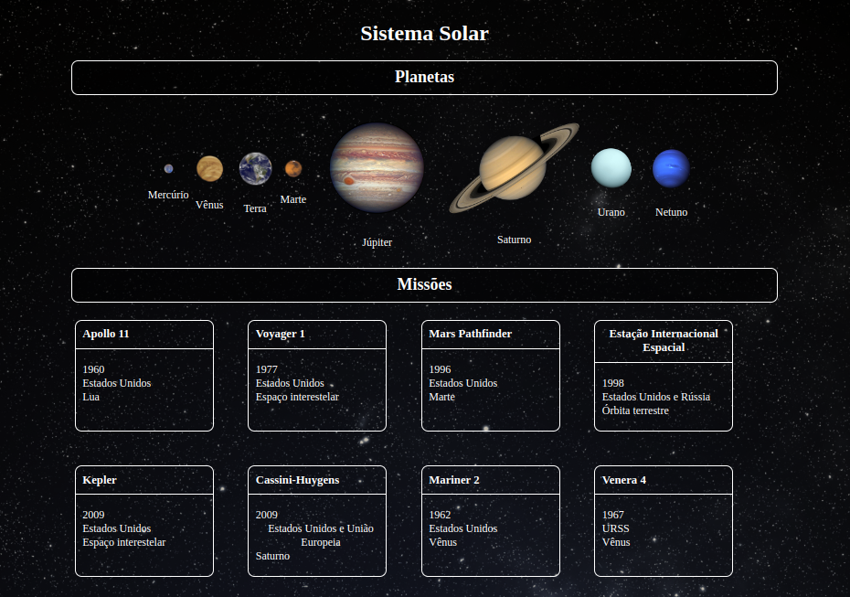

<h1>Projeto Sistema Solar</h1> 

Este projeto se trata de um modelo do sistema solar, o qual permite que a pessoa usuaria visualize todos os planetas do sistema solar renderizados na tela conjunto a cartas com informações sobre missões espacias.

O projeto em si foi criado dentro da escola de formação beTrybe, a fim de praticar a avaliar os conhecimentos aprendidos sobre React, props, propTypes, e criação de componentes em classes React.

  
<h1>Tecnologias utilizadas:</h1>
<ul>
  <li>JavaScript</li>
  <li>HTML</li>
  <li>CSS</li>
  <li>React</li>
</ul>
<h1>Como rodar o projeto:</h1>

Para que o projeto possa rodar em sua maquina, sera necessario ter instalado o <a href="https://nodejs.org/en/" target="_blank" >node</a>, e o gerenciador de pacotes <a href="https://docs.npmjs.com/downloading-and-installing-node-js-and-npm" target="_blank" >NPM(node package manager)</a>. Apos todas as dependencias do projeto serem instaladas, basta abrir o terminal dentro da pasta do projeto, rodar o comando 'npm install' para que todas as dependencias sejam instaladas, e em seguida abrir o projeto com o comando 'npm install'

